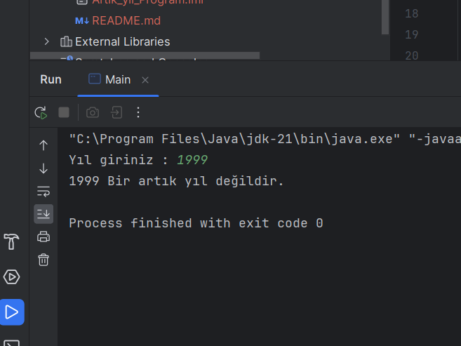

# Artık Yıl Hesaplayıcı

##  Artık Yıl Nedir?

### Artık yıl, Miladî takvimde 365 yerine 366 günü olan yıl. Bu fazladan gün (artık gün), normalde 28 gün olan şubat ayına 29 Şubat’ın eklenmesi ile elde edilir.

- Kullanıcıdan alınan yıl değerine göre Artık Yıl olup olmadığını sorgulayan program.

